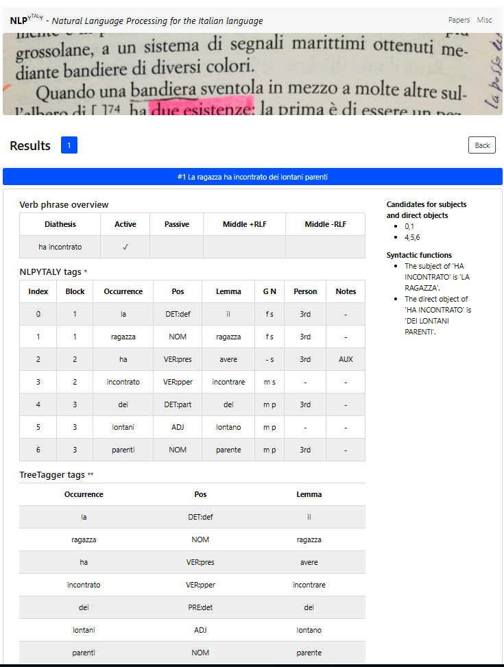

# What NLPYTALY is and what it does

NLPYTALY is software designed to obtain meaning representations from Italian sentences. Currently, the tool is more effective when dealing with monoclausal sentences. NLPYTALY functions by means of a rule-based system implemented with Python 3.8. Basic operations are performed with TreeTagger, a statistical parser which only provides: a) words as they appear in the text, b) their POS, and c) their lemmas. NLPYTALY permits the modification, where necessary, of such outcomes, whether that be the POS or the lemma (errors occur in both), and returns a richer morphosyntactic representation, which provides number, person, and gender features of relevant words, as well as constituency. Having inputted the text (unannotated), the following will be obtained: 

1. an identification of inflected verb phrases and proclitics (if any);

2. an identification of the diathesis on a morphological basis (i.e. without lists of verbs, unless they are necessary). The four diathesis types are: passive (*Fui graffiato* 'I was scratched'), middle reflexive (*Mi graffiai* 'I scratched myself') and middle non-reflexive (*Tornammo* 'We came back'), and, by exclusion, active (*I gatti graffiano* 'Cats scratch');

3. the detection of proper names and of noun phrases introduced by a determiner;

4. the identifying of Subject and Direct object;

5. the disambiguation of some function words (e.g. the use of *del*, *della*, *degli* etc as either prepositions or partitive articles; in the latter case, the POS is the following: `DET:part`);

6. the automatic extraction of semantic roles labelled Cognate Semantic Roles (this function will become available with the next release).

The outcomes of the tool will be available on a website, which can be accessed once a free account has been opened. The image below provides an example with the sentence 'The girl met (some) distant relatives':



# The label NLPYTALY

The name given to the parser NLPYTALY includes:

1. the acronym NLP, that is Natural Language Processing. Since NLP is generally data-driven, this acronym might be misleading because hitherto the tool is rule-based and its scripts are based on our current understanding of the syntax of the clause types being analysed;
2. the initial letters of the programming language deployed, that is Python (3.8);
3. the Italian TAL acronym, that is *Trattamento Automatico della Lingua*, i.e. one of the labels used to refer to Natural Language Processing;
4. a slightly different spelling of the nation where the analysed language is spoken.

# Installation

Requirements:

- python3.8
- virtualenv

Run the following commands:

``` 
git clone https://github.com/ignaziomirto2017/nlpytaly.git
python3 -m venv venv
source venv/bin/activate
pip3 install -r requirements.txt
```

**You'll also need to provide your implementation of `request_tags` in `request_tags.py` .** Please refer to [TreeTagger website](https://www.cis.uni-muenchen.de/~schmid/tools/TreeTagger/) for more information on how to install TreeTagger. The suggested Python wrapper is [this one](https://github.com/miotto/treetagger-python) and the parameter file used is [this one](https://www.cis.uni-muenchen.de/~schmid/tools/TreeTagger/data/italian.par.gz).
