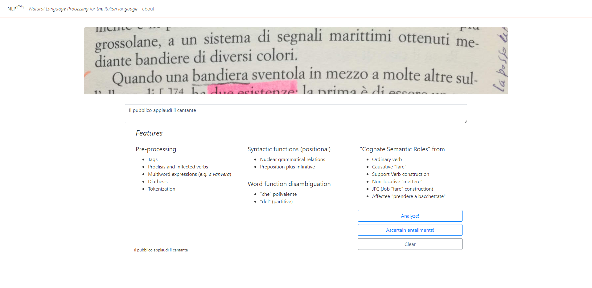
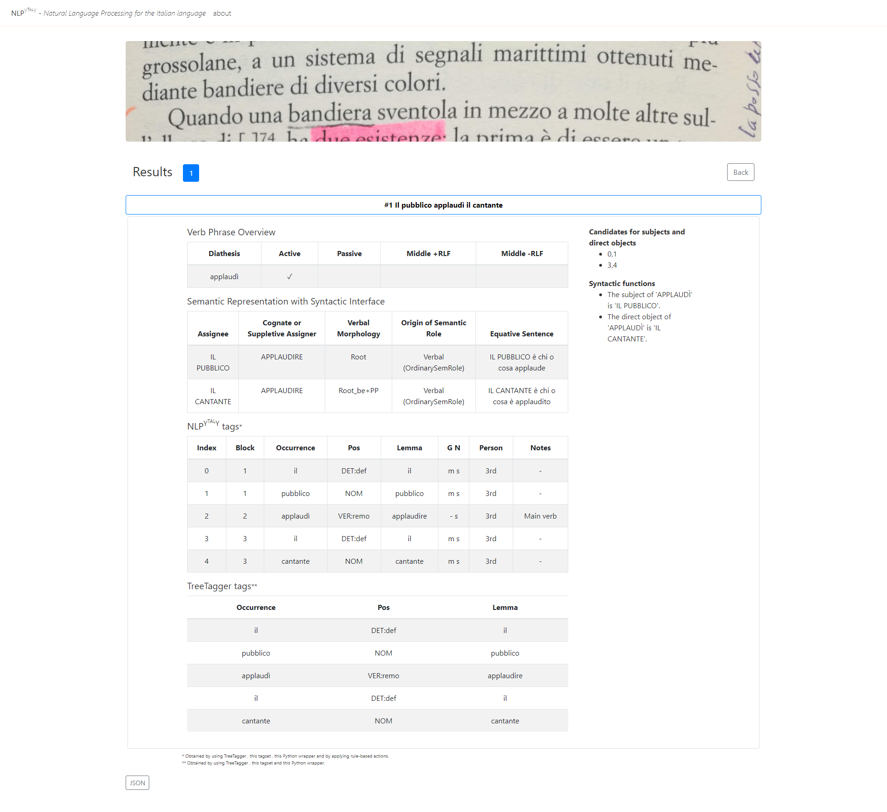
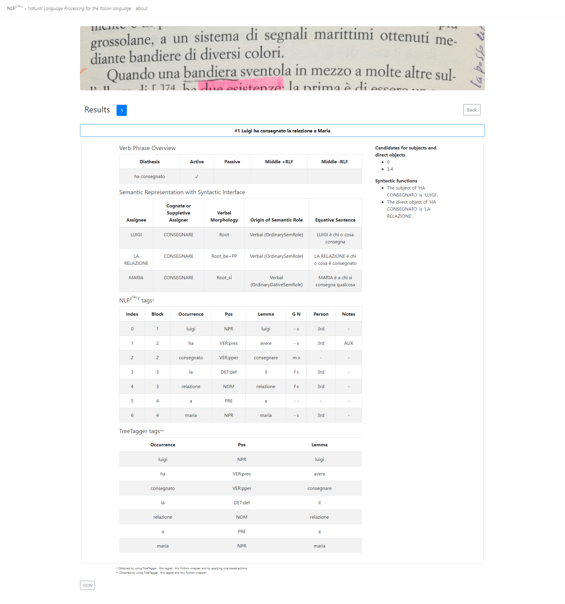
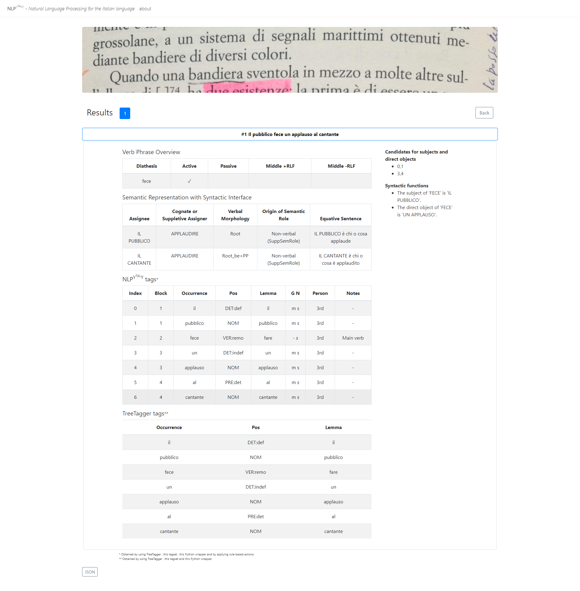
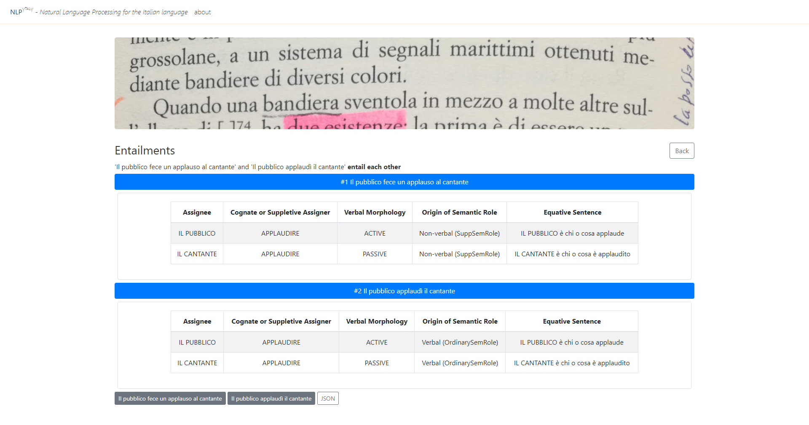
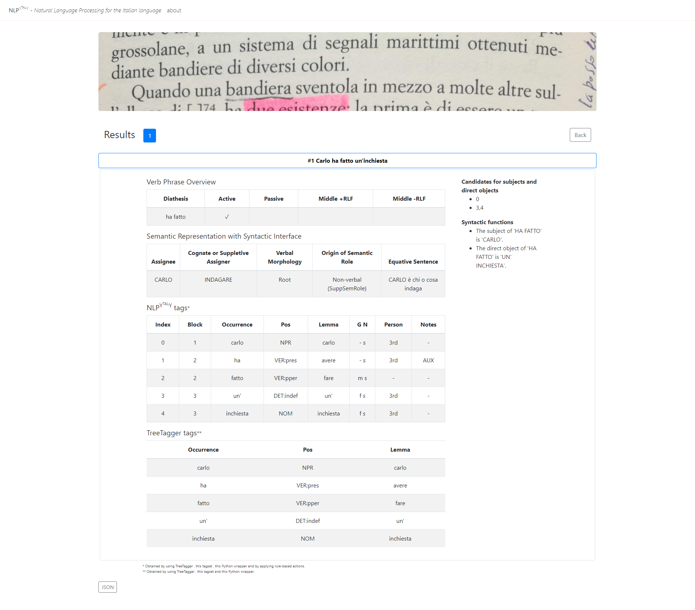

# What NLPytaly is and what it does

​	NLPytaly is a research project in Computational Linguistics and Natural Language Understanding started in 2019 by Ignazio Mauro Mirto (associate professor of General Linguistics at the University of Palermo, Italy). The software is mainly designed to obtain machine-readable meaning and **entailments** from Italian sentences. Given the limited number of supported constructions (described below), the tool is currently more effective when dealing with simple, monopredicative sentences (e.g. *Max spera* (Max hopes)), but also with a number of multipredicative sentences (e.g. the so-called light verb constructions, e.g. *Max nutre una speranza* (Max has/harbors a hope)).

​	The tool functions by means of a rule-based system implemented with Python 3.8. Basic operations are performed with TreeTagger, a statistical parser which only provides: a) words as they occur in the text, b) their POS, and c) their lemmas. NLPytaly permits the modification, where necessary, of such outcomes, whether that be the POS or the lemma (errors occur in both), and returns a richer morphosyntactic representation, which provides the features number, person, and gender of relevant words, as well as key elements of constituency. Having inputted unannotated text, the following will be obtained:

* an identification of inflected verb phrases and proclitics (if any); 

* an identification of the diathesis on a morphological basis (i.e. without lists of verbs, unless they are necessary). The four diathesis types are: Passive (*Fu applaudito* 'He was applauded'), Middle reflexive (*Mi applaudii* 'I applauded myself'), Middle non-reflexive (*Tornammo* 'We came back'), and, by exclusion, Active (*Noi applaudimmo* 'We applauded'); 

* the detection of most proper names and of noun phrases of three types: a) those introduced by a determiner (e.g. *il gatto* 'the cat'), b) bare plurals (e.g. *Lui ha visto gatti* 'He saw cats'), and c) kinship with zero-article (e.g. *mia moglie* 'my wife'); 

* the explicit identifying of Subject and Direct object (detection is based on word order); 

* the disambiguation of some function words (e.g. the use of *del*, *della*, *degli* etc as either prepositions or partitive articles; in the latter case, the POS is `DET:part`); 

* the automatic extraction of semantic roles.

​	The outcomes of the tool are available on a website, which can be accessed once a free account has been opened (see below). The following screenshots provide an example with the sentence *Il pubblico applaudì il cantante* (The audience applauded the singer):





## The logic of semantic roles in NLPytaly

​	The meaning which NLPytaly extracts is based on a novel type of semantic role (references are provided below), labeled as **Cognate Semantic Role** (henceforth, CSR). An example will help explain the use of the word ‘cognate’, which researchers employ most in diachronic linguistics (e.g. Latin MǓSCA and Italian *mosca* are etymologically related, and therefore they are **cognate words**): the sentence above, i.e. *Il pubblico applaudì' il cantante* (The audience applauded the singer), is semantically rendered in two steps:

* First step: *applaudì* is identified as the only predicate licensing arguments; it is transitive and therefore the following two CSRs will be assigned:

​			a)   *Chi applaude* (The one who applauds)

​			b)   *Chi è applaudito* (The one who is applauded)

​	In parallel with Case Grammar roles, CSRs depend on predicate-argument relations. However, whilst Case Grammar roles are expressed as one-word labels (e.g. Patient, Experiencer), CSRs are **statements** (more precisely, a specific type of relative clause) which obtain *automatically*. Such roles, which always employ a verb, are called ‘cognate’ because the content morpheme of the verb they contain is that of the predicate licensing arguments. However, suppletive forms may be necessary, mostly when the predicate licensing arguments is **non-verbal** (see below). Therefore, since in a) and b) above the predicate licensing arguments is *applaudì* (she applauded), the CSRs will contain a form of the verb *applaudire* (to applaud/clap).

* Second step: each CSR in a) and b) above will be matched with one of the participants (i.e. referents) which the sentence expresses. With (1) above, this yields the following **pairings**:

​			c)   *Il pubblico è chi applaude* (The audience is the one who applauds)

​			d)   *Il cantante è chi è applaudito* (The singer is the one who is applauded)

​	In order to obtain the outcome in c) and d) above **four fields** have to be identified. The first two, F1 and F2, derive from the predicate-argument structure of the sentence under scrutiny:

​			**F1** – Assignee: Argument/Participant

​			**F2** – Assigner: Predicate

​	For example, in the CSR in c) above, F1 is ‘il pubblico’ and F2 is the verb ‘applaudire’.

​	The third field – **F3** – relates to the morphology of the verb which a CSR must contain. This verb is invariably in the simple present and in the 3rd person. However, it can take three possible forms (others will probably be necessary): Root (simple present and 3rd person), Root_be+PP (the verb *essere*/*be* occurs, followed by a past participle, as in passives), and Root_si (*si* being a 3rd person clitic). The following screenshot of the sentence *Luigi ha consegnato la relazione a Maria* (Luigi handed the report to Maria) permits to illustrate the three verbal forms in F3:



​	The fourth field – **F4** – provides syntactic information on the **origin of the semantic role**, i.e. on the predicate licensing arguments (henceforth, the licenser). The supported constructions from which CSRs derive are of two types: verbal and non-verbal. F4 shows whether the licenser is verbal or non-verbal and, in the latter case, which type of non-verbal predicate assigns semantic roles.

​	So far, **seven types** **of constructions** have been included, which are illustrated below (notice that, with certain constructions, some diatheses are not yet supported):

### Verbal

* ​	OrdinarySemRole (for verbs licensing subjects and direct objects); 

* ​	OrdinaryDativeSemRole (for verbs licensing indirect objects); 

* ​	CausativeSemRole (for the subject licensed by the causative predicates *fare*); 

### Non-Verbal

* ​	SuppSemRole (for arguments licensed by the nominal predicate of a support verb construction, see screenshot below); this construction involves thousands of nouns; so far, the dictionary only includes about 100 of such nouns, which show the potential of the model; 

* ​	JobSemRole (for the subject licensed by the predicative noun of the Job_Fare_Construction, e.g. *Sua moglie fa l'ingegnere* (His wife is an engineer)); the dictionary includes about 4, 800 nouns designating jobs; 

* ​	**Ate**SemRole (e.g. *prendere a cannon**ate***; for arguments licensed by a predicative prepositional phrase in a construction in which the verb *prendere* combines with a plural noun ending with the plural suffix -*ate* (overall, about 80 prepositional phrases): *La nave ha preso a cannonate la città* (The ship cannonaded/shelled the town)); 

* ​	MetterePrepSemRole (for arguments licensed by predicative prepositional phrases in a non-locative construction with the verb *mettere*, e.g. *La polizia ha messo sotto sorveglianza i locali* (Police put the premises under surveillance)); there are more than 300 non-locative prepositional phrases which enter the construction; so far the dictionary includes about 100.

​	Finally, NLPytaly displays a column, the rightmost, providing an **equative sentence** - exemplified by the pairings in c) and d) above - which provides a semantic representation (more precisely, the propositional content or kernel) of the parsed sentence by describing **who-does-what-to-whom** (as in a theatrical performance), i.e. the role (or involvement) which each participant (beings or things) plays in the scenario the parsed sentence calls forth.

## Entailment detection

​	The syntax-semantics interface described above easily allows the identification of a number of entailments. Accordingly, paraphrases between sentences sharing some content morphemes can be identified. For example, a support verb counterpart of *Il pubblico applaudì il cantante* (i.e. sentence (1)) is the following: *Il pubblico fece un applauso al cantante* (The audience gave the singer a round of applause). The tool identifies the construction type, i.e. it identifies the post-verbal *un applauso* as the predicate giving origin to semantic roles (below, see the column Origin of Semantic Role), and it therefore returns the following screenshots (the first displays the analysis, the second shows the entailment):





​	Entailment detection is computed on the basis of the sets of cognate semantic roles produced by each sentence. Let *A* be the set of CSRs obtained by the first sentence and *B* the set of CSRs obtained by the second sentence. Then, the following four cases are possible: 

1. if A is a subset of B and *vice versa*, then the tool returns **Mutual entailment** (the **entail each other** in the screenshot above);
2. if A is a subset of B, then the tool returns **B entails A** (*modus ponens*):

   e.g., *Alle bambine furono dati i regali* (The gifts were given to the girls) and *Piero ha dato i regali alle bambine* (Piero gave the gifts to the girls)
3. if no mutual or partial entailment apply, but one or more CSRs are in common, then the tool returns **No entailment, however there are common CSRs**:

   e.g., *La mamma ha fatto accompagnare il bambino dalla nonna* (The mother had her grandmother accompany the child) and *Il bambino si è fatto accompagnare dalla nonna* (The child was accompanied by his grandmother)
4. if there are no entailments and no common CSRs, the tool returns **No entailment**:

   e.g.	*Piero ha mangiato* (Piero ate) and *Luca ha dormito* (Luca slept)

### Equality of Cognate Semantic Roles

​	To assess whether a set of CSRs is a subset of another one, it is necessary to understand when two CSRs are equal. As a general rule, two CSRs are equal when the fields F1, F2 and F3 are identical. F1 is a string, F2 is an array of strings (the first element is always verbal) and F3 is a string. Most of the times F2 has length 1; however, it may contain other word, as in the following case, which permits the detection of a certain kind of entailment (which is still work in progress):

* *L'amico è stato insultato* (My friend was insulted) and *L'amico è stato preso a parolacce* (Profanities were uttered against my friend)

| Assignee | Cognate or Suppletive Assigner | Verbal Morphology | Origin of Semantic Role  | Equative Sentence                |
| -------- | ------------------------------ | ----------------- | ------------------------ | -------------------------------- |
| L'AMICO  | INSULTARE                      | PASSIVE           | Verbal (OrdinarySemRole) | L'AMICO è chi o cosa è insultato |

| Assignee | Cognate or Suppletive Assigner | Verbal Morphology | Origin of Semantic Role | Equative Sentence                |
| -------- | ------------------------------ | ----------------- | ----------------------- | -------------------------------- |
| L'AMICO  | INSULTARE, PAROLACCE           | PASSIVE           | Non-verbal (parolacce)  | L'AMICO è chi o cosa è insultato |

## Suppletion

​	The non-verbal predicate *applauso*, analyzed above, does have a verbal counterpart, i.e. the verb *applaudire*. As shown above, this makes entailment detection straightforward. However, a number of non-verbal predicates do not have a corresponding verb with the same root, as is the case, for example, with the noun *inchiesta* (inquiry; the verb *inchiedere* is obsolete): *Carlo ha fatto un'inchiesta* (Carlo did an investigation). If this is the case, a suppletive verb is used in the dictionary entry of such nouns, as shown in the following screenshot and in the ensuing analysis (this way, an entailment obtains by typing the sentences *Carlo ha fatto un'inchiesta* and *Carlo ha indagato* (Carlo investigated)):

```python
    # data > verb_support.py
    "inchiesta": {"verbi_supp": ["fare"], "verbo": "indagare"},
    "incursione": {"verbi_supp": ["fare"], "verbo": "penetrare"},
    # ...
```



# The label NLPytaly

​	The name given to the parser NLPytaly includes:

1. the acronym NLP, that is Natural Language Processing. Since NLP is generally data-driven, this acronym might be misleading because hitherto the tool is rule-based. Its scripts are based on our current understanding of the syntax of the clause types being analyzed;
2. the initial letters of the programming language deployed, that is Python (3.8);
3. the Italian TAL acronym, that is *Trattamento Automatico della Lingua*, i.e. one of the labels used to refer to Natural Language Processing;
4. a slightly different spelling of the country where the parsed language is spoken.
# Installation

Requirements:

* python3.8
* virtualenv

Run the following commands:

```
git clone https://github.com/ignaziomirto2017/NLPytaly.git
python3 -m venv venv
source venv/bin/activate
pip3 install -r requirements.txt
```

**You'll also need to provide your implementation of `request_tags` in `request_tags.py` .** Please refer to [TreeTagger website](https://www.cis.uni-muenchen.de/~schmid/tools/TreeTagger/) for more information on how to install TreeTagger. The suggested Python wrapper is [this one](https://github.com/miotto/treetagger-python) and the parameter file used is [this one](https://www.cis.uni-muenchen.de/~schmid/tools/TreeTagger/data/italian.par.gz).

# Demo

Interested? A small playground is online at http://nlpytaly.duckdns.org. Send a mail to ignaziomauromirto@gmail.com to request free access or, alternatively, have a look at:

* [Computational linguistics/Meaning extraction - A demo of NLPytaly - Video_1: Causative sentences vs ordinary sentences | Ignazio Mauro Mirto - Academia.edu](https://www.academia.edu/video/jKmV4l) (in Italian)

* [Measuring Meaning. The rationale of Semantic Role Labeling | Ignazio Mauro Mirto - Academia.edu](https://www.academia.edu/video/kzMgJl)
* [Machine-readable entailments and Automatic Recognition of Paraphrases in Italian | Ignazio Mauro Mirto - Academia.edu](https://www.academia.edu/video/l4wXZ1)
# References
1. Mirto, Ignazio Mauro (2022), Measuring meaning (2022), in Arai, K. (ed.), Intelligent Computing, LNNS 283, pp. 1054-1067. ISBN 978-3-030-80119-9; DOI https://doi.org/10.1007/978-3-030-80119-9
2. Mirto, Ignazio Mauro (2021), Automatic extraction of semantic roles in support verb constructions, *International Journal on Natural Language Computing* (IJNLC) Vol.10, No.3, 1-10; [(1) (PDF) Automatic Extraction of Semantic Roles in Support Verb Constructions | Ignazio Mauro Mirto - Academia.edu](https://www.academia.edu/49054848/Automatic_Extraction_of_Semantic_Roles_in_Support_Verb_Constructions)
3. Mirto, Ignazio Mauro (2020), [Natural Language Inference in Ordinary and Support Verb Constructions](https://link.springer.com/chapter/10.1007/978-3-030-53036-5_13), in Dong *et al* (eds.), *Distributed Computing and Artificial Intelligence, 17th International Conference*, Springer Nature Switzerland, 124-133. https://link.springer.com/chapter/10.1007/978-3-030-53036-5_13
4. Mirto, Ignazio Mauro (2019), The role of cognate semantic roles: Machine Translation support for support verb constructions, [(1) (PDF) The role of cognate semantic roles: Machine translation support for support verb constructions | Ignazio Mauro Mirto - Academia.edu](https://www.academia.edu/38859556/The_role_of_cognate_semantic_roles_Machine_translation_support_for_support_verb_constructions)
5. Mirto, Ignazio Mauro (in stampa), L'estrazione automatica dei ruoli semantici corradicali: *the importance of being cognate*, in Messina S. *et al.* (eds.), *Scritti in onore di Annibale Elia* (provisional title), Penguin-Random House. [(PDF) L'estrazione automatica dei ruoli semantici corradicali. The importance of being cognate | Ignazio Mauro Mirto - Academia.edu](https://www.academia.edu/39796685/Lestrazione_automatica_dei_ruoli_semantici_corradicali_The_importance_of_being_cognate)
6. Mirto, Ignazio Mauro (2007), Dream a little dream of me. Cognate predicates in English, in *Actes du 26e Colloque International Lexique-Grammaire*, Bonifacio, Corse (France), 2-6 October 2007, Camugli C., M. Constant e A. Dister (eds.), 121-128; on-line: http://infolingu.univ-mlv.fr/Colloques/Bonifacio/proceedings/mirto.pdf
